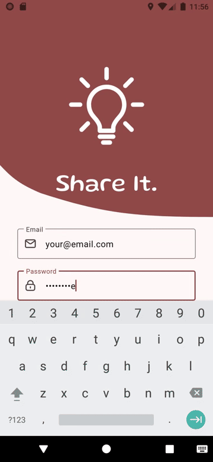
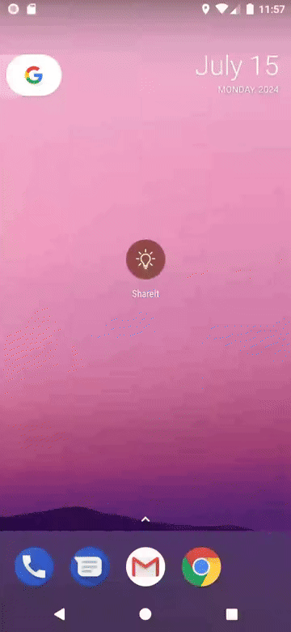
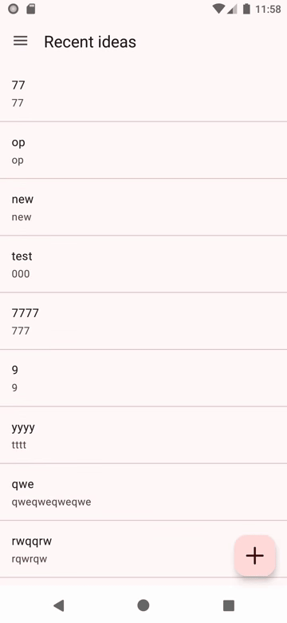
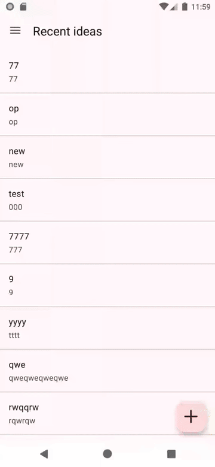

# Share It

## _Share your ideas rn_

 

## Table of Contents

- [Description](#description)
- [System Requirements](#system-requirements)
- [Installation](#installation)
- [Instructions](#instructions)
- [Testing](#testing)
- [Dependencies](#dependencies)
- [Contributors](#contributors)

## Description
A tiny application that has the power to provide you with any sorts of other people's ideas. If it's not enough and you feel inspired enough, feel free to share your thoughts with the world. It's easy as nothin': just go through a momentary signing-up process, and you're in!

## System Requirements

Your device has to meet the following requirements:
- Android OS with API Level $\geq$ 24 (version 7.0 or higher);
- 1 GB of RAM;
- ~50 MB of free space.

## Installation

For now, you can get the app by checking the repository's _[/out](./out/)_ dir.

## Instructions

Let's say you're looking for some inspiration. You open the app and are greeted with an authorization page. It's enough to provide your _Email_ and _Password_ no matter what you're about to do: sign-in or sign-up:

Once you're in, you can observe recent ideas. It's possible to click on every on them in order to get their full content:

But what if you're here to actually _Share it_? Alright, you can just click on _+_ button in the right bottom and you're ready to compose your idea. Once you're done, don't forget to click on _Save_ button:

## Testing

Almost every class has been covered with tests (Unit & Instrumentation). The coverage percentage was roughly 70% at the time.

## Dependencies

The following noticeable libraries & frameworks are in use in the app:
- [RxJava](https://github.com/ReactiveX/RxJava) (ReactiveX implementation for Java; used for state management purposes, etc.);
- [Firebase Authentication](https://firebase.google.com/docs/auth) (a part of Firebase SDK that provides user authentication means);
- [Firebase Realtime Database](https://firebase.google.com/docs/auth) (a part of Firebase SDK that provides an access to NoSQL cloud storage);
- [Navigation Component](https://developer.android.com/guide/navigation) (a set of tools that introduces a navigation system into your project);
- [Dagger Hilt](https://dagger.dev/hilt/) (DI empowered for Android);
- [Espresso](https://developer.android.com/training/testing/espresso) (Android instrumentation tests);
- [Mockito](https://github.com/mockito/mockito) (mocking classes for tests);

## Contributors

The application was fully made by Semyon Dzukaev in 2024. All rights reserved.
